## 引言

Linux 系统的启动过程是一个复杂而精密的过程，涉及固件、引导加载器、内核、init 系统等多个组件的协同工作。对于运维工程师来说，深入理解启动过程不仅有助于快速定位系统启动故障，还能优化启动性能、实现系统定制化配置。

本文将从底层硬件到用户空间，详细剖析现代 Linux 系统（以 UEFI + Systemd 为例）的完整启动流程，并提供实用的故障排查技巧。

## Linux 启动的六大阶段

Linux 系统启动可以分为以下六个主要阶段：

1. **固件阶段（BIOS/UEFI）**
2. **引导加载器阶段（GRUB2）**
3. **内核初始化阶段**
4. **Initramfs 阶段**
5. **Init 系统阶段（Systemd）**
6. **用户空间启动阶段**

## 阶段一：固件初始化（BIOS/UEFI）

### BIOS 模式启动

传统 BIOS（Basic Input/Output System）是计算机启动时执行的第一段代码：

**工作流程：**
1. **POST（加电自检）**：检测 CPU、内存、硬件设备
2. **读取 MBR**：从启动设备的 MBR（Master Boot Record，前 512 字节）加载引导代码
3. **转交控制权**：跳转到 MBR 中的引导代码（通常是 GRUB Stage 1）

**MBR 结构：**
```
偏移量          大小        内容
0x000 - 0x1BD   446字节     引导代码（Boot Loader Stage 1）
0x1BE - 0x1FD   64字节      分区表（4个分区条目，每个16字节）
0x1FE - 0x1FF   2字节       魔数（0x55AA，表示有效的引导扇区）
```

### UEFI 模式启动

现代系统普遍采用 UEFI（Unified Extensible Firmware Interface）：

**优势：**
- 支持 GPT 分区表（突破 MBR 的 2TB 限制）
- 提供图形化界面和网络功能
- 安全启动（Secure Boot）机制
- 更快的启动速度

**工作流程：**
1. **固件初始化**：初始化硬件，加载 UEFI 驱动
2. **读取 ESP**：从 EFI 系统分区（ESP）读取引导文件
3. **加载 Boot Loader**：执行 `/EFI/[发行版]/grubx64.efi` 等引导程序

**查看 UEFI 引导条目：**
```bash
# 查看当前引导条目
efibootmgr -v

# 示例输出
BootCurrent: 0001
BootOrder: 0001,0000,0002
Boot0000* Windows Boot Manager
Boot0001* ubuntu	HD(1,GPT,...)/File(\EFI\ubuntu\shimx64.efi)
Boot0002* UEFI: Built-in EFI Shell
```

**检查 ESP 分区：**
```bash
# 查找 ESP 分区
lsblk -f | grep vfat

# 挂载并检查内容
mount /dev/sda1 /boot/efi
tree /boot/efi/EFI
```

## 阶段二：引导加载器（GRUB2）

GRUB2（GRand Unified Bootloader version 2）是目前最流行的 Linux 引导加载器。

### GRUB2 的工作阶段

**Stage 1（boot.img）**：
- 位置：MBR 或 ESP 分区
- 大小：512 字节（BIOS）或更大（UEFI）
- 功能：加载 Stage 1.5

**Stage 1.5（core.img）**：
- 位置：MBR 后的间隙或 `/boot/grub` 目录
- 功能：包含文件系统驱动，能读取 `/boot` 分区

**Stage 2**：
- 位置：`/boot/grub/` 目录
- 功能：加载完整的 GRUB2 环境，显示启动菜单

### GRUB2 配置文件

主配置文件：`/boot/grub/grub.cfg`（自动生成，不建议手动编辑）

**查看配置：**
```bash
cat /boot/grub/grub.cfg | grep menuentry
```

**自定义配置目录：**
```bash
# 主配置
/etc/default/grub

# 自定义脚本
/etc/grub.d/
├── 00_header          # 基础设置
├── 10_linux           # Linux 内核条目
├── 20_linux_xen       # Xen 虚拟化
├── 30_os-prober       # 检测其他操作系统
└── 40_custom          # 自定义条目
```

**常用配置示例：**
```bash
# /etc/default/grub
GRUB_TIMEOUT=5                          # 菜单超时时间
GRUB_DEFAULT=0                          # 默认启动项
GRUB_CMDLINE_LINUX_DEFAULT="quiet splash"  # 内核参数
GRUB_CMDLINE_LINUX="net.ifnames=0"      # 额外内核参数
GRUB_GFXMODE=1024x768                   # 图形模式分辨率
```

**更新 GRUB 配置：**
```bash
# Debian/Ubuntu
update-grub

# RHEL/CentOS
grub2-mkconfig -o /boot/grub2/grub.cfg

# UEFI 系统
grub2-mkconfig -o /boot/efi/EFI/centos/grub.cfg
```

### GRUB2 故障恢复

**进入 GRUB 救援模式：**
```bash
# GRUB 救援 shell
grub rescue> ls                         # 列出分区
grub rescue> ls (hd0,msdos1)/           # 查看分区内容
grub rescue> set root=(hd0,msdos1)      # 设置根分区
grub rescue> set prefix=(hd0,msdos1)/boot/grub
grub rescue> insmod normal              # 加载 normal 模块
grub rescue> normal                     # 进入正常模式
```

**重新安装 GRUB：**
```bash
# 从 Live CD 启动后
mount /dev/sda1 /mnt
mount --bind /dev /mnt/dev
mount --bind /proc /mnt/proc
mount --bind /sys /mnt/sys
chroot /mnt

# BIOS 系统
grub-install /dev/sda

# UEFI 系统
grub-install --target=x86_64-efi --efi-directory=/boot/efi
```

## 阶段三：内核初始化

### 内核加载过程

GRUB 将内核镜像和 initramfs 加载到内存后，跳转到内核入口点。

**内核启动参数：**
```bash
# 查看当前内核参数
cat /proc/cmdline

# 示例输出
BOOT_IMAGE=/vmlinuz-5.15.0-56-generic root=UUID=xxx ro quiet splash
```

**常用内核参数：**
```bash
ro                    # 只读挂载根文件系统（稍后重新挂载为读写）
quiet                 # 减少启动信息输出
splash                # 显示启动画面
init=/bin/bash        # 指定 init 程序（故障恢复用）
single / 1            # 单用户模式
systemd.unit=rescue.target  # 启动到救援模式
```

### 内核初始化步骤

1. **解压缩**：解压缩内核镜像（vmlinuz）
2. **硬件检测**：初始化 CPU、内存、设备驱动
3. **挂载 rootfs**：挂载临时根文件系统
4. **加载 initramfs**：解压并切换到 initramfs
5. **启动 init 进程**：启动 PID 1 进程（通常是 systemd）

**查看内核日志：**
```bash
# 内核环形缓冲区
dmesg | less

# 查看特定阶段
dmesg | grep -i "boot"
dmesg | grep -i "mounted root"

# 持久化日志
journalctl -k        # 仅查看内核日志
journalctl -b        # 查看本次启动日志
```

**分析启动耗时：**
```bash
# 内核启动耗时
systemd-analyze time

# 输出示例
Startup finished in 3.5s (firmware) + 2.1s (loader) + 4.2s (kernel) + 5.8s (userspace) = 15.6s
```

## 阶段四：Initramfs 阶段

### Initramfs 的作用

Initramfs（Initial RAM File System）是一个临时的根文件系统，提供必要的工具和驱动来挂载真正的根文件系统。

**为什么需要 Initramfs？**
- 根分区可能在 LVM、RAID、加密卷或网络文件系统上
- 内核无法内置所有驱动，需要动态加载
- 提供早期用户空间环境

**查看 Initramfs 内容：**
```bash
# 解压 initramfs
mkdir /tmp/initramfs
cd /tmp/initramfs
unmkinitramfs /boot/initrd.img-$(uname -r) .

# 或者
lsinitramfs /boot/initrd.img-$(uname -r) | less
```

**重建 Initramfs：**
```bash
# Debian/Ubuntu
update-initramfs -u

# RHEL/CentOS
dracut --force

# 指定特定内核版本
mkinitramfs -o /boot/initrd.img-5.15.0-56 5.15.0-56-generic
```

### Initramfs 执行流程

1. **挂载 /proc、/sys、/dev**
2. **加载必要的内核模块**（存储驱动、文件系统驱动）
3. **设备检测**：运行 udev，创建设备节点
4. **挂载真正的根文件系统**
5. **切换根**：`switch_root` 到真实的根文件系统
6. **启动 systemd**

**查看 initramfs 的 init 脚本：**
```bash
# 查看初始化脚本
cat /tmp/initramfs/init

# 查看关键函数
grep -A 10 "mount_root" /tmp/initramfs/init
```

## 阶段五：Systemd 初始化

Systemd 作为现代 Linux 的 init 系统（PID 1），负责启动和管理所有系统服务。

### Systemd 的核心概念

**Unit 类型：**
- **service**：系统服务（如 nginx.service）
- **target**：一组 unit 的集合（如 multi-user.target）
- **mount**：挂载点（如 /home）
- **socket**：套接字激活
- **timer**：定时任务（替代 cron）
- **device**：设备单元

**Target 层级关系：**
```
systemd
└── default.target (通常是 graphical.target 或 multi-user.target)
    ├── multi-user.target
    │   ├── basic.target
    │   │   ├── sysinit.target
    │   │   │   ├── local-fs.target
    │   │   │   ├── swap.target
    │   │   │   └── cryptsetup.target
    │   │   └── sockets.target
    │   ├── network.target
    │   ├── sshd.service
    │   └── ...其他服务
    └── display-manager.service (仅 graphical.target)
```

### Systemd 启动流程

1. **加载默认 target**：
```bash
# 查看默认 target
systemctl get-default

# 设置默认 target
systemctl set-default multi-user.target
```

2. **并行启动依赖的 units**：
```bash
# 查看 multi-user.target 的依赖
systemctl list-dependencies multi-user.target
```

3. **挂载文件系统**：
```bash
# 查看挂载单元
systemctl list-units --type=mount

# 查看 /etc/fstab 生成的挂载单元
ls /run/systemd/generator/*.mount
```

4. **启动网络服务**：
```bash
systemctl status NetworkManager
systemctl status systemd-networkd
```

5. **启动关键系统服务**：
```bash
# 查看所有服务状态
systemctl list-units --type=service
```

### 分析启动性能

**查看启动耗时最长的服务：**
```bash
systemd-analyze blame

# 输出示例（前10个）
     5.234s NetworkManager-wait-online.service
     3.456s plymouth-quit-wait.service
     2.123s systemd-networkd-wait-online.service
     1.567s accounts-daemon.service
```

**生成启动链图：**
```bash
# 生成 SVG 图表
systemd-analyze plot > /tmp/boot.svg

# 生成依赖关系图
systemd-analyze dot | dot -Tsvg > /tmp/deps.svg
```

**查看关键路径：**
```bash
systemd-analyze critical-chain

# 输出示例
graphical.target @5.8s
└─multi-user.target @5.8s
  └─NetworkManager.service @3.2s +2.5s
    └─network-pre.target @3.1s
      └─firewalld.service @1.8s +1.2s
        └─basic.target @1.7s
```

### 常见服务管理

```bash
# 查看服务状态
systemctl status sshd

# 启动/停止/重启服务
systemctl start sshd
systemctl stop sshd
systemctl restart sshd

# 开机自启
systemctl enable sshd
systemctl disable sshd

# 查看服务日志
journalctl -u sshd -f

# 查看失败的服务
systemctl --failed
```

## 阶段六：用户空间启动

### 登录管理器

**图形界面登录（Display Manager）：**
```bash
# 常见的显示管理器
systemctl status gdm       # GNOME
systemctl status sddm      # KDE
systemctl status lightdm   # 轻量级
```

**文本界面登录（getty）：**
```bash
# 查看 getty 服务
systemctl status getty@tty1

# 配置虚拟终端数量
ls /etc/systemd/system/getty.target.wants/
```

### 用户登录流程

1. **getty 或 display manager 启动**
2. **用户认证**：通过 PAM（Pluggable Authentication Modules）
3. **加载用户环境**：
   - `/etc/profile`（全局）
   - `~/.bash_profile` 或 `~/.profile`（用户级）
   - `~/.bashrc`（非登录 shell）

**PAM 配置：**
```bash
# SSH 登录的 PAM 配置
cat /etc/pam.d/sshd

# 示例内容
auth       required     pam_sepermit.so
auth       substack     password-auth
account    required     pam_nologin.so
account    include      password-auth
password   include      password-auth
session    required     pam_loginuid.so
session    include      password-auth
```

### 系统初始化脚本

**传统 SysVinit 脚本（兼容性）：**
```bash
# rc.local（已过时，但某些系统仍支持）
/etc/rc.local

# systemd 兼容服务
systemctl status rc-local
```

**Systemd 用户自定义服务：**
```bash
# 创建开机自启脚本
cat > /etc/systemd/system/my-startup.service <<EOF
[Unit]
Description=My Startup Script
After=network.target

[Service]
Type=oneshot
ExecStart=/usr/local/bin/my-startup.sh
RemainAfterExit=yes

[Install]
WantedBy=multi-user.target
EOF

systemctl enable my-startup.service
```

## 启动故障排查

### 常见启动问题

**1. GRUB 损坏**
```bash
# 症状：无法找到引导设备，黑屏显示 "grub rescue>"
# 解决：从 Live CD 重新安装 GRUB（参见前面章节）
```

**2. 内核 Panic**
```bash
# 症状：启动时出现 "Kernel panic - not syncing"
# 排查：
# - 检查 /boot 分区是否完整
# - 尝试启动旧版本内核
# - 检查硬件兼容性（特别是新硬件）

# 从 GRUB 菜单选择旧内核启动
```

**3. 根文件系统损坏**
```bash
# 症状：initramfs 无法挂载根分区，进入紧急模式
# 解决：
(initramfs) fsck /dev/sda1    # 文件系统检查
(initramfs) exit              # 继续启动
```

**4. Systemd 服务失败**
```bash
# 查看失败的服务
systemctl --failed

# 分析特定服务
systemctl status failed-service
journalctl -xeu failed-service
```

**5. 进入紧急模式**
```bash
# 在 GRUB 菜单按 'e' 编辑启动参数
# 在 linux 行末尾添加：
systemd.unit=rescue.target     # 救援模式
systemd.unit=emergency.target  # 紧急模式
init=/bin/bash                 # 直接进入 shell（无密码，需重新挂载根分区）

# 紧急模式下重新挂载根分区为读写
mount -o remount,rw /
```

### 启动日志分析

```bash
# 查看本次启动日志
journalctl -b

# 查看上次启动日志
journalctl -b -1

# 查看所有启动记录
journalctl --list-boots

# 查看特定时间段
journalctl --since "2026-02-16 10:00:00"

# 查看内核消息
journalctl -k

# 持续监控
journalctl -f
```

## 优化启动速度

### 禁用不必要的服务

```bash
# 查看启动耗时
systemd-analyze blame

# 禁用不需要的服务（示例）
systemctl disable bluetooth.service
systemctl disable ModemManager.service
systemctl disable NetworkManager-wait-online.service
```

### 并行化启动

Systemd 默认已经并行启动服务，但可以优化依赖关系：

```bash
# 检查服务依赖
systemctl list-dependencies --all sshd.service

# 自定义服务时，使用正确的依赖关系
[Unit]
After=network.target    # 等待网络（不阻塞）
Wants=network.target    # 弱依赖（不强制）
Requires=postgresql     # 强依赖（必须成功）
```

### 使用静态 IP（避免 DHCP 等待）

```bash
# NetworkManager 配置
nmcli con mod eth0 ipv4.method manual \
  ipv4.addresses "192.168.1.100/24" \
  ipv4.gateway "192.168.1.1" \
  ipv4.dns "8.8.8.8"
```

### 减少 GRUB 超时

```bash
# /etc/default/grub
GRUB_TIMEOUT=1

# 更新配置
update-grub
```

## Linux 启动流程图

以下是完整的 Linux 启动流程图，展示了从加电到用户登录的全过程：

```mermaid
graph TD
    A[加电] --> B{固件类型?}
    B -->|BIOS| C[BIOS POST 自检]
    B -->|UEFI| D[UEFI 固件初始化]
    
    C --> E[读取 MBR]
    E --> F[加载 GRUB Stage 1]
    
    D --> G[读取 ESP 分区]
    G --> H[加载 GRUB EFI]
    
    F --> I[GRUB Stage 1.5<br/>core.img]
    H --> I
    I --> J[GRUB Stage 2<br/>加载配置文件]
    
    J --> K[显示启动菜单<br/>等待用户选择]
    K --> L[加载内核 vmlinuz]
    L --> M[加载 initramfs]
    
    M --> N[内核解压缩]
    N --> O[内核初始化<br/>CPU/内存/设备]
    O --> P[挂载临时根文件系统]
    P --> Q[解压 initramfs 到内存]
    
    Q --> R[执行 /init 脚本]
    R --> S[加载必要驱动<br/>存储/文件系统]
    S --> T[运行 udev<br/>设备管理]
    T --> U{根分区类型?}
    
    U -->|普通分区| V[挂载根分区]
    U -->|LVM| W[激活 LVM 卷组]
    U -->|RAID| X[组装 RAID 阵列]
    U -->|加密| Y[解锁 LUKS 加密卷]
    
    W --> V
    X --> V
    Y --> V
    
    V --> Z[switch_root<br/>切换到真实根分区]
    Z --> AA[启动 systemd<br/>PID 1]
    
    AA --> AB[加载默认 target<br/>default.target]
    AB --> AC[sysinit.target<br/>系统初始化]
    
    AC --> AD[挂载 /etc/fstab<br/>中的文件系统]
    AD --> AE[启动 swap 交换空间]
    AE --> AF[启动 udev<br/>设备管理]
    AF --> AG[加载内核模块]
    AG --> AH[设置主机名<br/>时区等]
    
    AH --> AI[basic.target<br/>基础系统]
    AI --> AJ[启动 socket 服务]
    AJ --> AK[启动 timer 定时器]
    
    AK --> AL{运行级别?}
    AL -->|多用户| AM[multi-user.target]
    AL -->|图形界面| AN[graphical.target]
    
    AM --> AO[启动网络服务<br/>NetworkManager]
    AN --> AO
    AO --> AP[启动系统服务<br/>SSH/Cron/日志等]
    
    AP --> AQ{目标?}
    AQ -->|多用户| AR[启动 getty@tty1-6<br/>文本登录]
    AQ -->|图形| AS[启动显示管理器<br/>GDM/SDDM]
    
    AR --> AT[等待用户登录]
    AS --> AT
    
    AT --> AU[PAM 认证]
    AU --> AV[加载用户环境<br/>/etc/profile]
    AV --> AW[加载用户配置<br/>~/.bashrc]
    AW --> AX[启动用户 shell<br/>或图形会话]
    
    AX --> AY[系统完全启动<br/>用户可用]
    
    style A fill:#ff6b6b
    style AY fill:#51cf66
    style AA fill:#4dabf7
    style L fill:#ffd43b
    style V fill:#ff922b
```



### 流程图说明

**关键阶段标识：**
- 🔴 **红色（加电）**：硬件启动
- 🟡 **黄色（内核加载）**：GRUB 引导阶段
- 🟠 **橙色（根分区挂载）**：Initramfs 阶段
- 🔵 **蓝色（Systemd）**：Init 系统阶段
- 🟢 **绿色（完成）**：用户登录完成

**时间估算（典型现代系统）：**
1. 固件阶段：2-4 秒
2. GRUB 阶段：1-2 秒（不计用户等待）
3. 内核 + Initramfs：3-5 秒
4. Systemd 初始化：5-10 秒
5. 用户空间：2-5 秒

**总计：约 15-30 秒（取决于硬件和配置）**

## 总结

Linux 启动过程是一个层次分明、逻辑严密的过程：

1. **固件层**：BIOS/UEFI 完成硬件初始化和引导设备定位
2. **引导层**：GRUB 提供多系统启动和内核参数配置
3. **内核层**：Linux 内核初始化硬件、加载驱动
4. **初始化层**：Initramfs 提供早期用户空间，挂载真实根分区
5. **系统层**：Systemd 并行启动系统服务
6. **用户层**：登录管理器提供用户认证和环境

掌握这些知识，运维工程师可以：
- 快速定位启动故障（GRUB 损坏、内核 panic、服务失败）
- 优化启动性能（禁用服务、减少超时、并行化）
- 实现高级配置（自定义内核参数、early boot 脚本、rescue 模式）
- 理解系统架构（依赖关系、服务管理、日志分析）

**延伸阅读：**
- [systemd 官方文档](https://systemd.io/)
- [GRUB2 手册](https://www.gnu.org/software/grub/manual/)
- [Linux 内核启动参数](https://www.kernel.org/doc/html/latest/admin-guide/kernel-parameters.html)
- [The Linux Boot Process](https://www.kernel.org/doc/html/latest/admin-guide/init.html)
