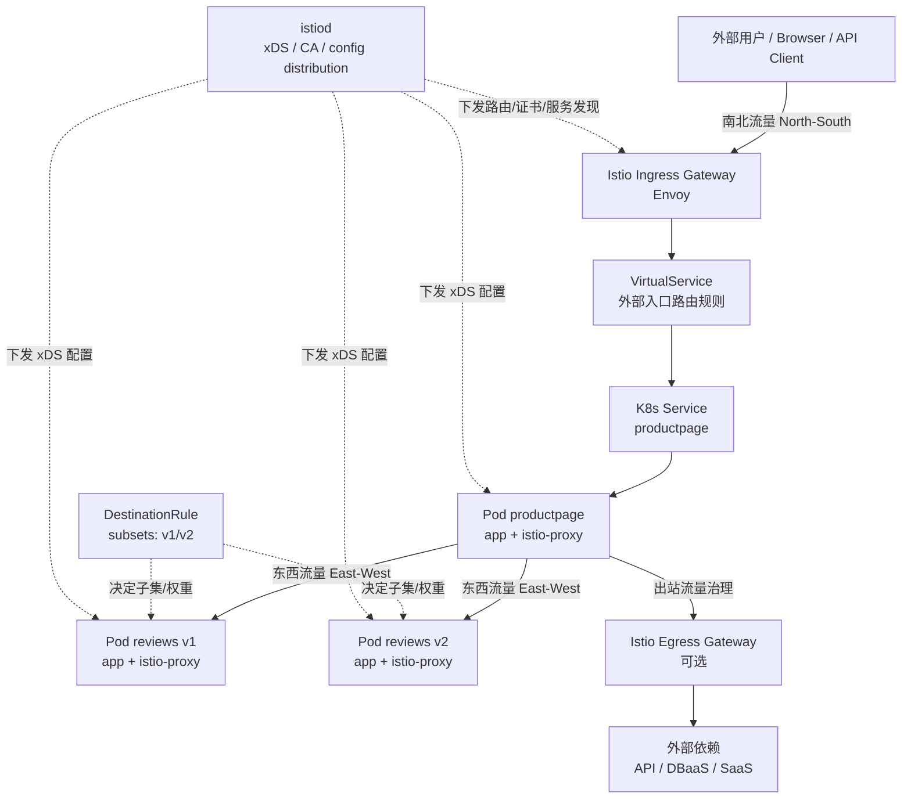
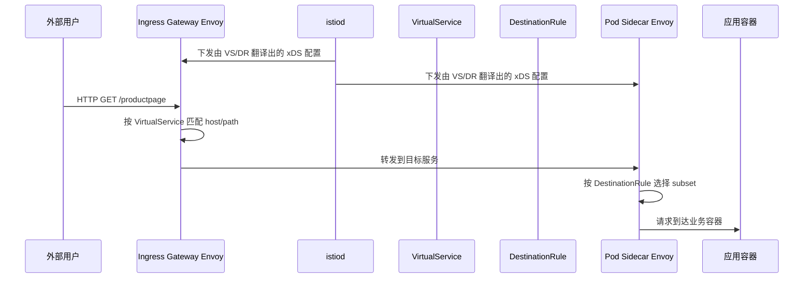

## 引言

Kubernetes 解决了容器编排、调度和服务发现的问题，但当微服务数量变多之后，团队很快会遇到新的难题：流量该怎么精细路由？灰度发布怎么做？服务间 mTLS、熔断、超时、重试、观测链路放在哪里？

Istio 的价值就在这里：**它不是替代 Kubernetes，而是补上 Kubernetes 在七层流量治理、服务安全和可观测性上的能力。** 如果把 Kubernetes 看成“把应用跑起来的系统”，那 Istio 更像“把服务之间的网络行为管起来的系统”。

## Istio 在 K8s 架构里的位置

从角色上看，Kubernetes 负责资源生命周期，Istio 负责流量生命周期。

| 层次 | Kubernetes 主要负责 | Istio 主要负责 |
| --- | --- | --- |
| 资源层 | Pod、Deployment、Service、Node 调度 | 不直接负责创建业务工作负载 |
| 网络四层 | ClusterIP、NodePort、基本 Service 负载均衡 | 不替代 kube-proxy/CNI |
| 网络七层 | 能力较弱 | 路由、灰度、镜像、限流、超时、重试、mTLS |
| 可观测性 | 需要额外组件拼装 | 天然暴露指标、访问日志、拓扑和 tracing 接口 |

Istio 的典型组成分成两块：

1. **控制面（Control Plane）**：以 `istiod` 为核心，负责下发配置、签发证书、管理服务发现。
2. **数据面（Data Plane）**：以 Envoy 代理为核心，通常以 sidecar `istio-proxy` 的形式跟随业务 Pod 一起运行。

## 一张图看懂 Istio 整体架构

下面这张图可以把“Kubernetes、Istio、南北流量、东西流量、VirtualService”放到一张架构图里：



这张图里最关键的理解是：

- **Kubernetes Service 仍然存在**，Istio 不会把它拿掉。
- **真正执行流量规则的是 Envoy**，不是 VirtualService 本身。
- **VirtualService 负责描述“怎么路由”**，`istiod` 把规则翻译后下发给 Envoy。

## 南北流量和东西流量，Istio 分别做了什么

### 南北流量（North-South）

南北流量指的是**集群外部进入集群内部**，或者集群内部访问外部系统的流量。常见场景包括：

- 用户访问网站入口
- 外部调用内部 API
- 集群访问外部支付、短信、第三方 OpenAPI

Istio 在这里常见的组件是：

- **Ingress Gateway**：处理外部进入集群的入口流量
- **Egress Gateway**：统一管理出站流量，便于审计和白名单控制
- **VirtualService**：定义外部请求该转发到哪个服务、哪个路径、哪个版本

一个典型能力组合如下：

```text
外部请求 -> Ingress Gateway -> VirtualService 匹配 host/path -> K8s Service -> Pod Sidecar
```

这意味着你可以在不改业务代码的情况下实现：

- 域名和路径转发
- 金丝雀发布
- Header 路由
- 超时与重试
- TLS 终止

### 东西流量（East-West）

东西流量指的是**集群内部服务与服务之间**的调用，比如：

- `productpage -> reviews`
- `reviews -> ratings`
- `order -> inventory`

这是 Istio 最有价值的区域。因为微服务稳定性问题，往往不是出在公网入口，而是出在**内部服务调用链**。

Istio 对东西流量能做的事情包括：

- 服务间 **mTLS**
- 基于版本的 **灰度/AB 测试**
- **熔断、限流、超时、重试**
- 统一指标、访问日志、Tracing

换句话说，Kubernetes 让服务能互相找到，**Istio 让服务之间“可控地通信”**。

## VirtualService 到底和 Istio 是什么关系

很多人第一次接触 Istio 时会误解：是不是有了 `VirtualService` 就自动有流量治理了？其实不是。

**VirtualService 是“声明路由意图”的 CRD，不是代理本身。**

它在架构中的位置可以这样理解：

| 对象 | 职责 | 是否直接转发流量 |
| --- | --- | --- |
| Service | 提供稳定服务名和基础转发入口 | 间接参与 |
| Gateway | 定义入口监听端口、协议、host | 不做复杂七层决策 |
| VirtualService | 描述 L7 路由规则 | 不直接转发 |
| DestinationRule | 描述目标子集、连接池、熔断策略 | 不直接转发 |
| Envoy sidecar / gateway proxy | 真正执行路由、重试、限流、mTLS | **是** |
| istiod | 把声明式规则翻译为 xDS 配置并下发 | 否 |

它们之间的调用关系如下：



所以可以记住一句话：

> **VirtualService 是规则，Envoy 是执行者，istiod 是翻译和分发者。**

## 实战：在 OrbStack 的 K8s 上跑一个 Istio 示例

下面这套示例尽量选最经典、最不绕的路径：**用 Bookinfo 同时演示南北流量入口和东西流量治理**。

### 1. 准备 OrbStack Kubernetes

先在 OrbStack 的设置页面启用 Kubernetes，然后确认 `kubectl` 上下文可用：

```bash
kubectl config get-contexts
kubectl config use-context orbstack
kubectl cluster-info
kubectl get nodes -o wide
```

如果你的上下文名称不是 `orbstack`，以 `kubectl config get-contexts` 的输出为准。

### 2. 安装 istioctl 和 Istio

```bash
brew install istioctl
istioctl version

istioctl install --set profile=demo -y
kubectl get pods -n istio-system
kubectl get svc -n istio-system
```

`demo` profile 很适合本地学习，组件齐全，排障成本低。

### 3. 部署 Bookinfo，并开启 sidecar 注入

```bash
kubectl create namespace demo
kubectl label namespace demo istio-injection=enabled --overwrite

curl -L https://istio.io/downloadIstio | sh -
cd istio-*

kubectl apply -n demo -f samples/bookinfo/platform/kube/bookinfo.yaml
kubectl get pods -n demo
```

看到每个业务 Pod 都有 `2/2` 容器时，说明 sidecar 注入成功，第二个容器通常就是 `istio-proxy`。

### 4. 暴露入口：演示南北流量

先创建 Gateway 和入口 VirtualService：

```bash
kubectl apply -n demo -f samples/bookinfo/networking/bookinfo-gateway.yaml
kubectl get gateway,virtualservice -n demo
```

本地环境最简单的访问方式通常是端口转发：

```bash
kubectl port-forward -n istio-system svc/istio-ingressgateway 8080:80
```

另开一个终端访问：

```bash
curl -I http://127.0.0.1:8080/productpage
open http://127.0.0.1:8080/productpage
```

这条链路就是标准的南北流量：

```text
Browser -> istio-ingressgateway -> VirtualService -> productpage Service -> Pod
```

### 5. 配置 reviews 灰度：演示东西流量

下面这份配置让 `reviews` 服务拆成两个 subset，并把流量按 90/10 分给 `v1` 和 `v2`：

```yaml
apiVersion: networking.istio.io/v1
kind: DestinationRule
metadata:
  name: reviews
  namespace: demo
spec:
  host: reviews
  subsets:
    - name: v1
      labels:
        version: v1
    - name: v2
      labels:
        version: v2
---
apiVersion: networking.istio.io/v1
kind: VirtualService
metadata:
  name: reviews
  namespace: demo
spec:
  hosts:
    - reviews
  http:
    - route:
        - destination:
            host: reviews
            subset: v1
          weight: 90
        - destination:
            host: reviews
            subset: v2
          weight: 10
```

保存成 `reviews-canary.yaml` 后应用：

```bash
kubectl apply -f reviews-canary.yaml
kubectl get destinationrule,virtualservice -n demo
```

这一步控制的是**服务内部调用链**，也就是东西流量。`productpage` 调用 `reviews` 时，请求会先到 `productpage` Pod 里的 sidecar，再由 sidecar 根据 `VirtualService + DestinationRule` 决定发给 `reviews v1` 还是 `reviews v2`。

### 6. 验证流量是否真的按规则生效

先看入口页面：

```bash
for i in {1..10}; do
  curl -s http://127.0.0.1:8080/productpage | grep -E "Reviewer|color" | head -n 2
done
```

再从集群内部验证东西流量路径。Bookinfo 自带服务调用链，也可以直接看 sidecar 日志：

```bash
kubectl logs -n demo deploy/productpage-v1 -c istio-proxy --tail=50
kubectl logs -n demo deploy/reviews-v1 -c istio-proxy --tail=20
kubectl logs -n demo deploy/reviews-v2 -c istio-proxy --tail=20
```

如果访问次数足够多，通常可以看到 `reviews-v1` 的日志明显多于 `reviews-v2`，这就是 90/10 权重的结果。

## 把 Istio 理解成“分布式网络 daemon”会更容易

用户提到“daemon 说明”，我觉得可以这样理解 Istio，最贴近实战：

- **`istiod`** 像集群里的控制面 daemon，负责配置分发和证书管理。
- **`istio-proxy`** 像每个业务 Pod 身边的网络 daemon，负责真正拦截和处理流量。
- **Ingress Gateway** 像统一入口 daemon，负责接住外部请求。

你可以用下面几条命令直接观察这个“daemon 化”的效果：

```bash
kubectl get pods -n istio-system
kubectl get pods -n demo

# 查看 sidecar 是否注入
kubectl get pod -n demo -l app=productpage -o jsonpath='{.items[0].spec.containers[*].name}'
echo

# 看 sidecar 日志
kubectl logs -n demo deploy/productpage-v1 -c istio-proxy --tail=30

# 看 istiod 控制面
kubectl logs -n istio-system deploy/istiod --tail=30
```

如果输出里能看到 `productpage istio-proxy` 两个容器名，说明这个 Pod 已经不是“单进程业务容器”模型，而是“业务容器 + 网络代理 daemon”协同工作的模型了。

## 一个最小可复用的 VirtualService 入口示例

如果你不想上来就跑 Bookinfo，也可以记住下面这个最小入口配置：

```yaml
apiVersion: networking.istio.io/v1
kind: Gateway
metadata:
  name: web-gateway
  namespace: demo
spec:
  selector:
    istio: ingressgateway
  servers:
    - port:
        number: 80
        name: http
        protocol: HTTP
      hosts:
        - "*"
---
apiVersion: networking.istio.io/v1
kind: VirtualService
metadata:
  name: web
  namespace: demo
spec:
  hosts:
    - "*"
  gateways:
    - web-gateway
  http:
    - match:
        - uri:
            prefix: /api
      route:
        - destination:
            host: my-api
            port:
              number: 8080
```

这个例子体现了最核心的关系：

- `Gateway` 决定“从哪儿进来”
- `VirtualService` 决定“进来以后怎么转”
- `Service + Pod + Envoy` 决定“最终请求落到哪里”

## 总结

Istio 在 Kubernetes 架构中的核心作用，不是替代 K8s，而是把服务之间的通信变成**可声明、可治理、可观察、可加密**的系统。

如果只记三件事：

1. **南北流量** 重点看 `Ingress/Egress Gateway`。
2. **东西流量** 重点看 sidecar `istio-proxy` 和服务间治理能力。
3. **VirtualService** 不是代理，它是流量规则的声明；真正执行规则的是 Envoy，真正下发规则的是 `istiod`。

对本地学习来说，**OrbStack + Istio demo profile + Bookinfo** 已经足够把整个链路跑通一遍。只要你真正看过一次 `ingressgateway`、`istiod`、`istio-proxy` 和 `VirtualService` 是怎么配合工作的，Istio 的抽象就会一下子清晰很多。
